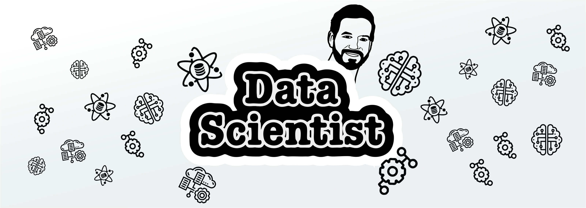
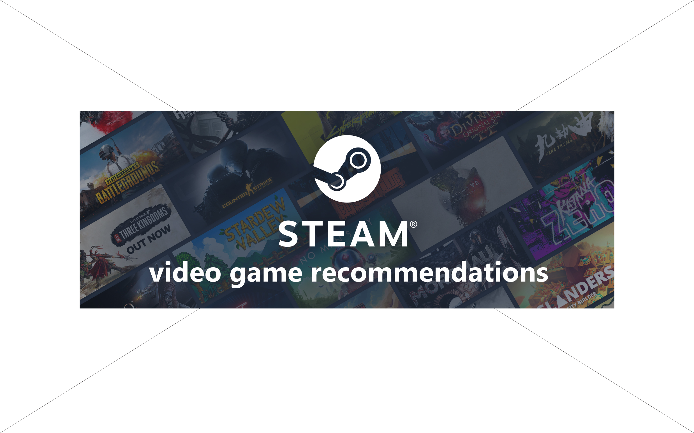

<h1 align="center">Hi, I'm Felipe Sepulveda 👋</h1>

## About me

- ⭐ Github Star ⭐ 
- 🤖 Data scientist
- 💻 Data analysis
- 🕹️ Machine learning
- 📗 Mathematics and accounting
 

## Cool Projects 
<table>
<tr>
<td width="50%">
<h3 align="center">DataLogic NY taxis</h3>

<!--img src="https://img.shields.io/badge/-Youtube-green?style=for-the-badge&color=fbfc40"-->
</a>

Project that aims to analyse the databases of new york taxis, electric cars accepted as taxis, noise and air pollution in order to help future customers make effective decisions when changing their taxi fleet, through predictive, recommendation and chat bot models that facilitate their choice.

                                                                                      
</td>

<td width="50%">
 
<h3 align="center"> Road Accidents</h3>

                                       

 

<!--a href="https://youtu.be/hhhSMXi0R3E" target="_blank">

</!--a>

In this project, we are assigned the role of data analysts to generate valuable information on the evolution of road crashes in the City of Buenos Aires between 2016 and 2021. To do so, we will use a dataset in xlsx format containing two sheets: events and victims.

                                                             
</table>                                                                                 

 

<table>
<tr>
<td width="50%">
<h3 align="center">Video Game Recommendations</h3>

<!--a href="https://youtu.be/UaR7GSNACsM" target="_blank">

</!--a>

This project covers all phases of the lifecycle of a Machine Learning project. The final result is an API deployed in Render, which allows queries to be made to the records of a database of the Steam platform. In addition, a video game recommendation model was developed based on cosine similarity, also accessible through the API.

 

### ⚙️ &nbsp;GitHub Analytics

  

<!--
**pipesito1/pipesito1** is a ✨ _special_ ✨ repository because its `README.md` (this file) appears on your GitHub profile.

Here are some ideas to get you started:

- 🔭 I’m currently working on ...
- 🌱 I’m currently learning ...
- 👯 I’m looking to collaborate on ...
- 🤔 I’m looking for help with ...
- 💬 Ask me about ...
- 📫 How to reach me: ...
- 😄 Pronouns: ...
- ⚡ Fun fact: ...
-->
