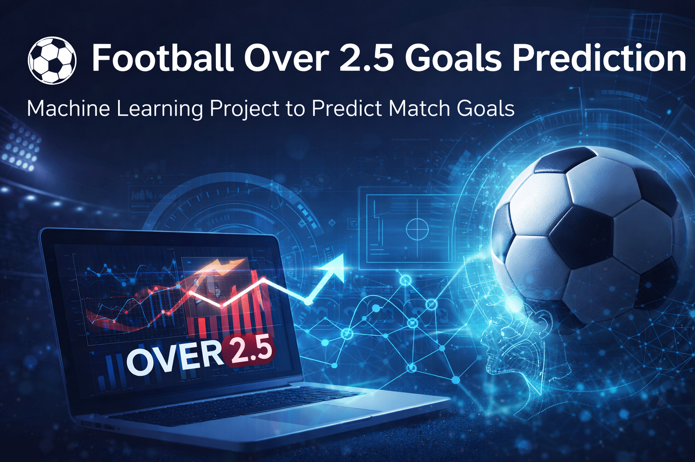
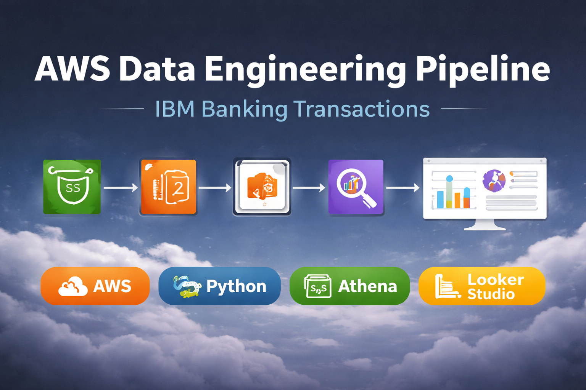

# Hi, I'm Felipe Sepulveda 👋

Data Scientist | Data Analyst | Machine Learning | Data Engineering

---

# 👨‍💻 About Me

- 🤖 Data Scientist & Data Analyst  
- 📊 Passionate about **Machine Learning and Data Engineering**
- ☁️ Interested in **Cloud Data Pipelines (AWS, GCP, SQL, Python)**
- 📗 Background in **Mathematics and Accounting**
- 🎨 Graphic Design & Web Design knowledge
- 🌎 Based in **Colombia**

---

# 🧠 Tech Stack

### Languages

### Data Science

### Data Engineering

### Visualization

---

# 🚀 Featured Projects

<table>
<tr>

<td width="50%">
<h3 align="center">DataLogic NY Taxis</h3>

 

Project that analyzes **New York taxi data, electric vehicles, noise levels and air pollution** to support fleet decision-making using **predictive models, recommendation systems and chatbots**.

</td>

<td width="50%">

<h3 align="center">Road Accidents Analysis</h3>

 

Data analytics project analyzing **road accidents in Buenos Aires (2016-2021)** to identify patterns, trends and insights that can support public safety decisions.

</td>

</tr>
</table>

---

<table>
<tr>

<td width="50%">

<h3 align="center">Video Game Recommendation System</h3>

 

Machine Learning system that builds a **video game recommendation engine** using **cosine similarity** and exposes results through a **deployed API**.

</td>

<td width="50%">

<h3 align="center">Football Over 2.5 Prediction</h3>

 

Machine Learning model that predicts **probability of Over 2.5 goals in live football matches** using **Random Forest and API match data**.

</td>

</tr>
</table>

---

<table>
<tr>

<td width="50%">

<h3 align="center">AWS Data Engineering Pipeline</h3>

 

Cloud **Data Engineering pipeline** that processes banking transaction datasets using **AWS services**:

• Raw data ingestion into Amazon S3  
• Data processing in EC2 using Python  
• Conversion to optimized Parquet format  
• Querying with Amazon Athena  
• Visualization using Looker Studio

</td>

<td width="50%">

<h3 align="center">Bank Fraud Detection System</h3>

 

End-to-end **Machine Learning project focused on detecting fraudulent banking transactions**.

The system analyzes transaction patterns and predicts whether a transaction is **legitimate or potentially fraudulent**, simulating how financial institutions use machine learning to strengthen fraud prevention systems.

</td>

</tr>
</table>

---

# 📊 GitHub Analytics

---

# 📬 Contact

- 💼 LinkedIn: https://www.linkedin.com/in/felipe-sepulveda-21684a115/  
- 📧 Email: jhesuafelipe24@gmail.com  
- 🌎 Portfolio: 

---

⭐ From [pipesito1](https://github.com/pipesito1)

